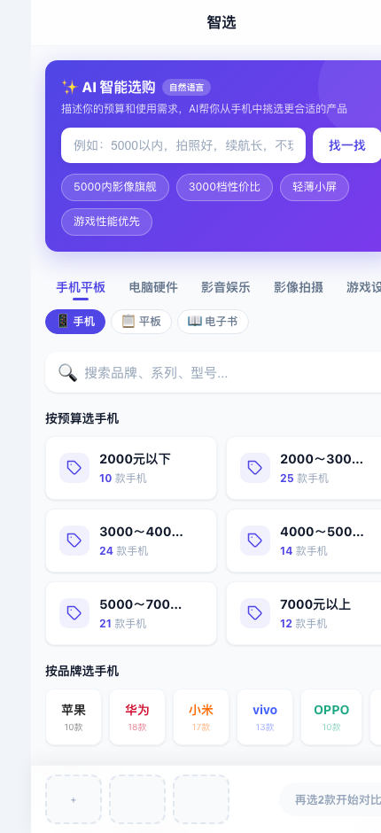
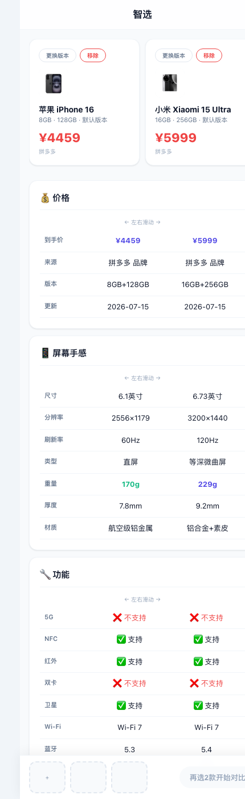
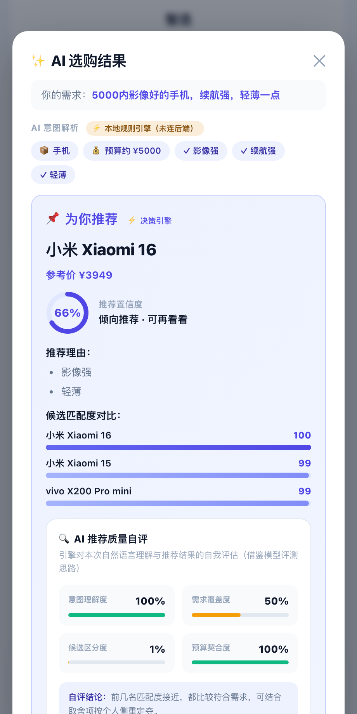
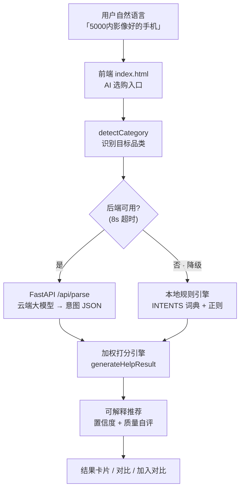

# 智选 · AI 电子产品决策助手

> 一个面向普通消费者的 **AI 驱动选购决策工具**：不再让用户对着一堆参数表发愁，而是把"我该买哪个"这个真实决策问题，交给一个可解释、可自评的推荐引擎来回答。

覆盖 **44 大品类、803 款真实产品**，纯前端零后端即可运行。

<p align="center">
  <a href="https://fengfengmay11-design.github.io/smart-pick/"><b>🔗 在线体验 Demo (GitHub Pages)</b></a>
</p>

<p align="center">
  
  
  
  
  
  
</p>

<p align="center">
  
  
  
</p>
<p align="center"><sub>首页多品类浏览　·　参数对比页　·　AI 自然语言选购</sub></p>

---

## 一、为什么做这个产品（Problem）

买数码产品时，用户真正的痛点从来不是"看不到参数"，而是 **"参数都在，但我不知道对我意味着什么"**：

- 京东/淘宝的参数表一列几十项，普通人根本读不懂"骁龙 8 Gen3 和天玑 9300 差在哪";
- 各种"选购攻略"充斥软广，缺乏中立、可解释的决策依据;
- 现有对比工具只做"参数并排展示"，把判断的活儿全甩给用户。

**核心洞察**：用户要的不是"更多信息"，而是"一个能替我权衡、并告诉我为什么的建议"。这正是 AI 能创造价值的地方。

## 二、产品是怎么解决的（Solution）

| 用户任务 | 传统对比工具 | 本产品 |
|---------|------------|--------|
| 找到候选产品 | 手动翻列表 | 品类切换 + 多维筛选 + 热度榜 |
| 理解参数差异 | 自己查资料 | 结构化分维度对比 + 差异高亮 |
| **做出最终决策** | **靠自己** | **AI 推荐引擎：加权打分 + 推荐理由 + 置信度 + 取舍提示** |
| 判断建议可不可信 | 无 | **AI 推荐质量自评面板** |

## 三、核心亮点：可解释 + 可自评的 AI 推荐引擎

这是本项目区别于普通"参数对比网页"的关键，也是产品的灵魂能力。

### 1. 自然语言选购（AI 入口）⭐
用户在首页直接用**一句人话**描述需求——如"5000 左右、拍照好、续航强的手机"——引擎会：
1. **意图解析**：从自由文本中抽取 **预算**（支持"5000 / 5k / 1.2 万 / 预算三千"等多种表达）、**品牌**、以及按品类构建的**语义偏好词典**（拍照/续航/轻薄/降噪/高刷……）；
2. **全库检索打分**：在整个品类库（而非仅已选产品）内加权打分，命中语义标签或数值维度即加分，超预算按幅度惩罚；
3. **可解释输出**：展示 AI 对这句话的意图解析结果 + Top3 推荐 + 置信度 + 理由 + 取舍，并支持一键"加入对比"。

> 这一步把产品从"填表单选参数"升级为"说人话即可"，是从规则工具迈向 AI 产品体验的关键设计。

### 2. 意图 → 加权打分 → 可解释推荐（已选产品内决策）
用户回答几个按品类动态生成的偏好问题（预算弹性、大屏/轻便、是否需要降噪……），引擎会：
1. **按品类适配打分维度**（手机看屏幕/重量/影像，显卡看显存/功耗，耳机看降噪……）；
2. 对每款候选做**加权打分并归一化**为 0–100 的匹配度；
3. 输出 Top 推荐，并给出**具体的推荐理由**和**需要接受的取舍**（不回避缺点）。

### 3. 推荐置信度模型
置信度并非拍脑袋，而是由 **第一名的领先幅度 + 理由充分度** 综合计算，并压缩到合理区间，避免"虚高的 99%"。让用户知道这条建议**有多值得信**。

### 4. AI 推荐质量自评面板（差异化设计 ⭐）
借鉴**大模型评测 / 数据质检**的思路，引擎会对自己的每次输出做一次"体检"，输出四个可信度指标：

| 指标 | 含义 |
|------|------|
| 需求覆盖度 | 用户偏好被命中的比例，衡量推荐是否"答非所问" |
| 候选区分度 | Top1 与 Top2 的差距，差距太小会如实提示"都不错" |
| 数据完整度 | 被推荐产品关键字段的非空比例 |
| 权衡透明度 | 是否如实暴露了取舍（暴露缺点 = 更可信） |

> 这个面板体现的产品理念是：**一个负责任的 AI，不仅要给答案，还要诚实地告诉用户"这个答案有多可靠"**。这也是 AI 产品在真实场景落地时最容易被忽视、却最关键的信任问题。

## 四、功能一览

- **44 大品类对比**：手机 / 平板 / 电子书 / 笔记本 / CPU / 显卡 / 显示器 / 键盘 / 鼠标 / 耳机 / 电视 / 投影仪 / 相机 / 镜头 / 运动相机 / 无人机 / 游戏主机 / 掌机 / 手柄 / 智能手表 / 手环 / 戒指 / VR / AR / 路由器 / NAS / 空调 / 扫地机器人 / 服务机器人 等，共 803 款真实型号
- **两级轻量分类导航**：一级横向 Tab（8 大类）+ 当前组具体品类 Chip，分类区仅占 2 行高度
- **多品类通用框架**：通过品类配置对象抽象数据访问，新增品类零改动渲染逻辑
- **智能对比**：最多 3 款并排，按品类拆分维度、自动高亮差异、生成结论（去"性价比"偏置，按系统/防水/屏幕/芯片等真实维度给建议）
- **AI 自然语言选购**：一句话描述需求，AI 解析意图并从全库推荐；输入框/快捷词/说明文案随所选品类动态联动（详见上文）
- **AI 帮我选**：在已选产品内做可解释推荐（详见上文）
- **动态筛选与排序**：筛选条件按品类自动切换（价格 / 品牌 / 参数区间）
- **多平台比价**：展示不同电商渠道到手价（京东 / 拼多多 / 参考价，取最低真实价）
- **移动端优先**：430px 移动容器，毛玻璃导航 + 渐变按钮的现代 UI

## 五、技术栈与架构

- **纯前端单页应用**：原生 HTML/CSS/JavaScript，零框架、零依赖，开箱即用
- **数据分层**：`index.html`（视图 + 逻辑）+ 44 个品类数据文件（`data/` 下的 `phone-data.js` + 43 个 `data-*.js`，由 `migration/build-data-js.js` 从 V2 规范化数据库自动生成）
- **V2 规范化数据库**（`database/v2/`）：products / brands / categories / specs / variants / prices / tags 分层 JSON，配 `validate-db.js` 全库校验（0 致命错误）+ `db-adapter.js` 等价性验证
- **品类抽象层**：`CATEGORIES` 配置对象 + `cat()` 统一数据访问入口，解耦渲染与数据；44 品类零硬编码分支
- **AI 品类预设体系**：`AI_PRESETS` 44 品类专属文案 + 8 分组 fallback + 通用兜底，新增品类零成本接入
- **推荐引擎**：`generateHelpResult()` —— 打分 / 归一化 / 置信度 / 质量自评
- **AI 意图理解后端（阶段二，可选）**：Python FastAPI + 大模型（DeepSeek，OpenAI 兼容），见 `server/`
- **部署**：前端任意静态托管即可（GitHub Pages / CloudStudio / Vercel）

### 分层架构：LLM 负责「理解」，引擎负责「决策」

本项目采用**两阶段可演进架构**，核心逻辑稳定，AI 能力逐层增强：

| 阶段 | 意图理解层 | 推荐决策层 | 形态 | 成本 |
|------|-----------|-----------|------|------|
| **阶段一** | 关键词规则匹配（`INTENTS` 词典 + 正则抽取预算） | 全库加权打分引擎 | 纯前端 | 零成本 |
| **阶段二** ✅ | **云端大模型**（把口语翻译成结构化意图 JSON） | **同一套打分引擎（复用不改）** | 前端 + FastAPI 后端 | 按调用量 |

> **设计要点**：大模型只替换「理解层」，把用户模糊口语（"给爸妈用、字大点"）翻译成结构化字段；
> 推荐排序仍由**确定性打分引擎**完成，保证结果可解释、可复现、无幻觉。
> 后端不可用时，前端 **8 秒超时自动降级**回本地规则引擎，核心功能永远可用 —— 大模型是「增强」而非「依赖」。
>
> API Key 只存在后端环境变量，`.env` 已加入 `.gitignore`，**绝不下发前端**，杜绝盗刷风险。

### 架构与数据流图



```
phone-compare/
├── index.html          # 主应用（视图 + AI 推荐引擎 + 品类配置 + 后端调用/降级）
├── engine.js           # 推荐引擎纯逻辑层（品类识别/预算解析），被前端与测试共用
├── favicon.svg         # 站点图标
├── data/               # 44 个品类数据文件（由 migration/build-data-js.js 从 V2 库生成）
│   ├── phone-data.js   #   手机数据（93 款，含真实产品图 CDN）
│   ├── data-gpu.js     #   显卡（209 款）
│   ├── data-cpu.js     #   CPU（40 款）
│   ├── data-laptop.js  #   笔记本（40 款）
│   ├── data-ac.js      #   空调（40 款）
│   ├── data-robot.js   #   扫地机器人（40 款）
│   ├── data-earphone.js#   耳机（45 款）
│   ├── data-monitor.js #   显示器（40 款）
│   ├── data-tablet.js  #   平板（24 款）
│   ├── data-camera.js  #   相机（24 款）
│   ├── data-tv.js      #   电视（24 款）
│   ├── data-watch.js   #   智能手表（20 款）
│   ├── data-keyboard.js#   机械键盘（20 款）
│   └── …（其余 30 个品类）
├── tests/
│   └── run.js          # 零依赖单元测试（node tests/run.js）
└── server/             # 阶段二 AI 后端（Python FastAPI + 大模型意图理解）
    ├── main.py         #   /api/parse：自然语言 → 结构化意图 JSON
    ├── requirements.txt
    ├── .env.example    #   填 Key（DeepSeek/通义/Kimi/OpenAI 任选）
    └── README.md       #   3 分钟申请免费 Key + 启动 + 面试话术
```

## 六、快速开始

### 方式一：纯前端运行（零后端，开箱即用）

```bash
# 克隆后，任选一种方式启动本地静态服务：
python3 -m http.server 8000
# 或
npx serve .

# 浏览器打开 http://localhost:8000
```

### 方式二：启用大模型后端（阶段二 LLM 意图理解）

```bash
cd server
cp .env.example .env        # 填入你的 DeepSeek / OpenAI API Key
./venv/bin/pip install -r requirements.txt   # 首次安装依赖
./venv/bin/python -m uvicorn main:app --port 8000

# 另一个终端启动前端（同方式一），AI 选购将自动走云端大模型
```

> 详细说明（免费 Key 申请、面试话术）见 [server/README.md](server/README.md)

### 部署到 GitHub Pages（永久在线 Demo）

本项目是纯静态站点，可直接部署到 **GitHub Pages**，获得永久可访问的 Demo 链接：

```bash
# 1. 在 GitHub 上创建仓库 smart-pick（公开）
# 2. 推送代码：
git remote add origin https://github.com/fengfengmay11-design/smart-pick.git
git push -u origin main

# 3. 在仓库 Settings → Pages → Source 选择 "Deploy from a branch"
#    Branch: main, Folder: /(root), Save
#    等待 ~1 分钟，Demo 即可通过以下地址访问：
#    https://fengfengmay11-design.github.io/smart-pick/
```

## 七、数据说明

- 产品型号、规格、价格为公开市场信息整理，用于产品原型演示；
- 价格与规格会随市场变化，条目含 `lastVerified` 标注核对日期；
- 本项目为个人作品集 / 产品原型，非商业销售平台。
- **数据层可扩展**：产品数据由独立数据模块（`phone-data.js` 等）提供，数据访问层设计为「可插拔」——可平滑替换为外部 API 接入，并内置超时与降级保护（不可达时回退本地数据）。
- **测试**：`node tests/run.js` 覆盖品类识别、预算解析，测试的是 `engine.js` 中的真实引擎代码（零依赖，开箱即跑）。

## 八、Roadmap

- [x] **阶段一**：自然语言输入需求 → 本地规则意图解析引擎（纯前端、零成本）
- [x] **阶段二**：接入真实大模型 API（DeepSeek）做意图理解，打分引擎复用不改，含优雅降级
- [ ] **阶段三**：接入 RAG 知识库（真实评测/参数/口碑向量化），让「为什么推荐它」带可溯源引用，消除幻觉
- [ ] 推荐结果 A/B 对比与用户反馈闭环
- [ ] 埋点与数据看板，量化推荐点击率 / 采纳率
- [ ] 产品数据自动化更新管线

---

## 关于作者

**tornadoli** · GitHub [@fengfengmay11-design](https://github.com/fengfengmay11-design)

AI 产品方向，关注 **AI 能力在真实消费场景的落地** 与 **AI 输出的质量评估**。本项目从一个"参数对比页"出发，重点探索了如何把 AI 做成**可解释、可自评、值得信任**的决策助手——而不只是一个更花哨的信息展示工具。

> 项目从手机对比起步，逐步演进为覆盖 44 大品类、803 款产品的通用决策框架，核心是产品定位的持续迭代与 AI 能力的深度设计。
